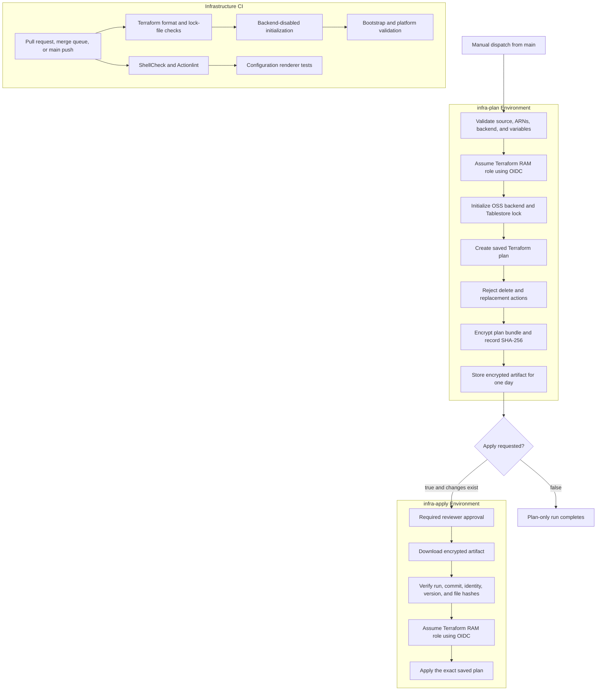

# Infrastructure Pipeline Design

## Purpose

The infrastructure pipeline validates and deploys the shared Alibaba Cloud
platform defined in `infra/platform`.

It intentionally does not automate `infra/bootstrap`. Bootstrap creates the
remote state bucket, state-lock table, OIDC provider, and Terraform RAM role
needed by the pipeline itself, so it remains an explicitly reviewed local
operation.

The implementation is split across two workflows:

- `.github/workflows/infra-ci.yaml` performs code-only validation.
- `.github/workflows/infra-platform.yaml` creates a saved plan and optionally
  applies that exact plan after approval.

## Pipeline Overview



## Trigger Contract

Infrastructure CI runs for:

- pull requests to `main`;
- merge queue validation;
- selected infrastructure paths pushed to `main`;
- manual dispatch.

Infrastructure Delivery is manual-only. It must be dispatched from `main` and
has one boolean input:

| Input   | Default | Result                                                                       |
| ------- | ------- | ---------------------------------------------------------------------------- |
| `apply` | `false` | Create, guard, encrypt, and retain a plan without changing cloud resources   |
| `apply` | `true`  | Create a fresh plan, then wait for `infra-apply` approval before applying it |

A plan-only run cannot later be converted into an apply run. Dispatch again
with `apply=true`; the workflow creates a fresh plan from current state before
requesting approval.

The workflow-level `terraform-platform` concurrency group serializes plan and
apply operations. Active infrastructure runs are never cancelled
automatically.

## Saved-Plan Integrity

Terraform saved plans can contain sensitive state-derived values. The workflow
therefore never uploads the plaintext plan.

The plan job:

1. creates `platform.tfplan`;
2. bundles it with the exact backend configuration, Terraform variables, and
   metadata;
3. records SHA-256 hashes for every bundled input;
4. encrypts the bundle with AES-256-CBC and PBKDF2 using 200,000 iterations;
5. uploads only the encrypted file with one-day retention;
6. removes plaintext plan material from the runner.

The encrypted metadata binds the artifact to:

- source commit SHA;
- GitHub run ID and attempt;
- Terraform version;
- Alibaba Cloud region;
- OIDC provider ARN;
- Terraform RAM role ARN;
- hashes of the plan, backend, and variable files.

After the `infra-apply` approval gate, the apply job checks the outer artifact
hash, decrypts the bundle, rejects unexpected archive members, checks every
metadata field and internal hash, initializes the recorded backend, and applies
the saved plan. It does not recalculate or substitute a different plan.

A passphrase mismatch, expired artifact, modified artifact, changed identity
configuration, or changed source revision fails before the apply job requests
Alibaba Cloud credentials.

## Destructive-Change Policy

The pipeline rejects any plan containing a resource delete or replacement.
There is no workflow input that bypasses this guard and no automated destroy
path.

Controlled teardown remains a separate, explicitly reviewed manual procedure.
See the platform Terraform README before destroying billable resources.

## GitHub Configuration

### Protected Environments

Create both Environments before inspecting OIDC claims:

| Environment   | Reviewer policy                                                          | Deployment branch |
| ------------- | ------------------------------------------------------------------------ | ----------------- |
| `infra-plan`  | No reviewer                                                              | `main` only       |
| `infra-apply` | Required reviewer; allow self-review only when no second reviewer exists | `main` only       |

The branch restriction is mandatory. An Environment-based OIDC subject
identifies the Environment, not the branch that selected it.

Do not define environment-level overrides for the common Terraform variables
listed below. Both jobs must resolve the same repository-level values; the
artifact checks reject identity differences, but a single configuration source
is easier to audit.

### Repository Variables

| Variable                              | Source                                | Required value             |
| ------------------------------------- | ------------------------------------- | -------------------------- |
| `ALIBABA_CLOUD_REGION`                | Platform design                       | `cn-shanghai`              |
| `ALIBABA_CLOUD_OIDC_PROVIDER_ARN`     | Bootstrap `github_oidc_provider_arn`  | Exact OIDC provider ARN    |
| `ALIBABA_CLOUD_ROLE_ARN`              | Bootstrap `github_terraform_role_arn` | Exact Terraform role ARN   |
| `TERRAFORM_STATE_BUCKET`              | Bootstrap `state_bucket_name`         | OSS state bucket           |
| `TERRAFORM_STATE_TABLESTORE_ENDPOINT` | Bootstrap `tablestore_endpoint`       | Public HTTPS endpoint      |
| `TERRAFORM_STATE_TABLESTORE_TABLE`    | Bootstrap `lock_table_name`           | Normally `terraform_locks` |
| `TERRAFORM_PLATFORM_VSWITCHES`        | Manually verified zone selection      | JSON object shown below    |
| `TERRAFORM_KUBERNETES_VERSION`        | Optional pinned ACS version           | Empty or `1.x.y-aliyun.n`  |

Example vSwitch JSON:

```json
{
  "a": {
    "zone_id": "cn-shanghai-e",
    "cidr_block": "10.20.0.0/20"
  },
  "b": {
    "zone_id": "cn-shanghai-f",
    "cidr_block": "10.20.16.0/20"
  }
}
```

Verify actual ALB, ACS, and RDS availability before selecting zones. The
renderer enforces structure and distinct values; Terraform enforces CIDR
containment and overlap rules.

### Environment Secret

Create the same secret in both `infra-plan` and `infra-apply`:

| Secret                      | Requirement                                                                                 |
| --------------------------- | ------------------------------------------------------------------------------------------- |
| `TERRAFORM_PLAN_PASSPHRASE` | Same randomly generated value in both Environments, at least 32 characters, with no newline |

Generate the value using a cryptographically secure password generator. Enter
it directly into both GitHub Environment secret forms, then discard the local
copy. Never commit it, place it in a repository variable, print it in logs, or
include it in screenshots.

No Alibaba Cloud AccessKey is stored in GitHub.

## OIDC Bootstrap Sequence

1. Merge the OIDC claim workflow and infrastructure workflows into `main`.
2. Create `infra-plan` and `infra-apply`, restrict both to `main`, and configure
   the apply reviewer policy.
3. Manually run `Inspect GitHub OIDC Claims` once for each infrastructure
   Environment.
4. Copy only the reported `sub` claims into the bootstrap
   `github_oidc_subjects` set.
5. Review and locally apply the bootstrap Terraform plan.
6. Record the bootstrap outputs as repository variables.
7. Configure the common encrypted-plan passphrase in both Environments.
8. Run Infrastructure Delivery with `apply=false`.

Never guess an OIDC subject or use a wildcard trust condition.

## First Platform Run

Before the first plan:

1. Complete Alibaba Cloud service activation and service-role authorization.
2. Apply bootstrap and preserve its local state securely.
3. Confirm the selected zones support ALB, ACS, and the configured RDS class.
4. Confirm all repository variables and both Environment secrets are present.
5. Run Infrastructure CI and require it on the pull request.
6. Dispatch Infrastructure Delivery from `main` with `apply=false`.
7. Review the Terraform output, resource counts, source SHA, and encrypted
   artifact SHA-256.
8. Confirm the initial plan contains creates only.
9. Dispatch again with `apply=true`.
10. Review the new plan and approve `infra-apply` within the artifact's one-day
    retention window.
11. Observe the apply result and inspect only non-sensitive Terraform outputs
    locally when configuring downstream services.

## Failure Semantics

| Failure point                   | Result                                                       |
| ------------------------------- | ------------------------------------------------------------ |
| Infrastructure CI               | No cloud authentication or platform plan                     |
| Invocation or input validation  | No cloud authentication                                      |
| OIDC exchange                   | No backend or cloud access                                   |
| Backend initialization          | No plan artifact                                             |
| Plan error                      | No apply request                                             |
| Delete or replacement detected  | Plan fails and no artifact is uploaded                       |
| Encryption or upload            | No apply request                                             |
| Apply approval                  | Apply waits without cloud credentials                        |
| Artifact or metadata validation | Apply fails before cloud authentication                      |
| Apply OIDC exchange             | Saved plan is not applied                                    |
| Terraform apply                 | Run fails; inspect state and cloud resources before retrying |

## Local Validation

These checks do not initialize the remote backend or contact Alibaba Cloud:

```bash
./scripts/test-render-terraform-platform-config.sh

TERRAFORM_OFFLINE=1 \
  ./scripts/validate-terraform.sh
```

Infrastructure CI additionally runs ShellCheck and Actionlint in a pinned,
read-only, network-disabled container.

## Known Limitations

- The assessment uses one least-privilege Terraform lifecycle RAM role for both
  plan and apply. The GitHub Environment enforces approval at the workflow
  boundary. A production design should use separate read-only planning and
  mutating apply roles.
- The encrypted-plan passphrase is duplicated across two Environment secrets
  and must be rotated consistently.
- The public ACS API is required for GitHub-hosted runners.
- Plans containing replacements or deletions require the separate manual
  procedure.
- The automated platform workflow currently supports only `cn-shanghai`.
