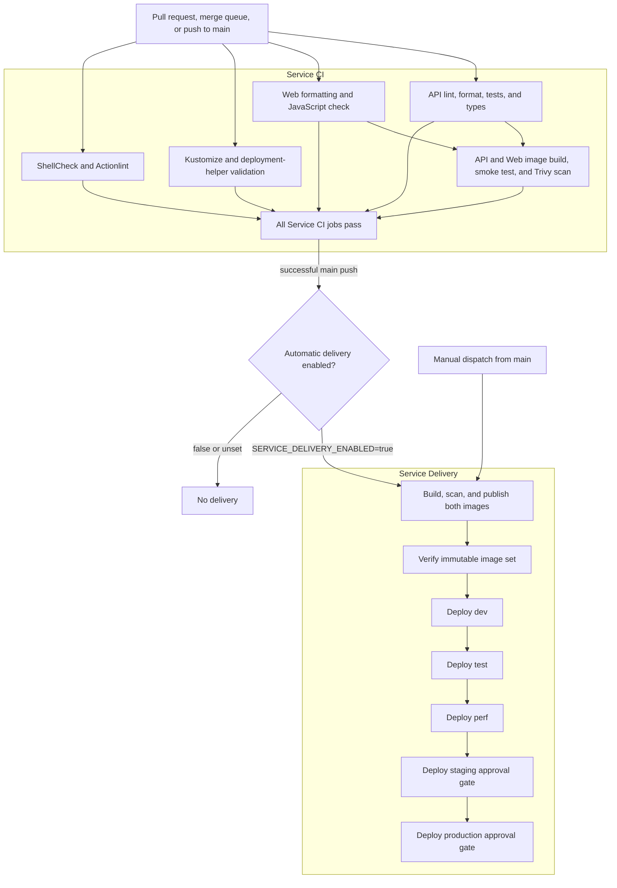

# Service Pipeline Design

## Purpose

The service pipeline builds, verifies, publishes, and promotes the portfolio API
and Web images through five environments:

```text
dev -> test -> perf -> staging -> production
```

The same immutable image digests are promoted through every environment. Images
are never rebuilt between stages.

The implementation is split across three workflows:

- `.github/workflows/service-ci.yaml` validates source, containers, Kubernetes
  manifests, workflow syntax, and deployment helpers.
- `.github/workflows/service-delivery.yaml` publishes the two images and controls
  promotion order.
- `.github/workflows/service-deploy-environment.yaml` is the reusable,
  environment-scoped deployment implementation.

## Pipeline Overview



## Trigger and Promotion Contract

Service CI runs for pull requests to `main`, merge queue validation, selected
push paths on `main`, and manual dispatch.

Service Delivery supports two trusted entry points:

- a successful Service CI run caused by a push to `main`, provided repository
  variable `SERVICE_DELIVERY_ENABLED` is exactly `true`;
- a manual dispatch of Service Delivery from `main`.

The automatic switch should remain unset or `false` until the cloud platform,
ACR repositories, protected environments, secrets, and OIDC roles are ready.
Manual dispatch intentionally bypasses the switch but still requires `main`.

The publish matrix creates the API and Web images once. Each image must pass its
container smoke test and the fixable-critical Trivy gate before it is pushed.
The pipeline resolves the registry digest and passes references in this form:

```text
<registry>/<namespace>/portfolio-api@sha256:<64 hexadecimal characters>
<registry>/<namespace>/portfolio-web@sha256:<64 hexadecimal characters>
```

The image-set verification job rejects missing, extra, malformed, or
cross-registry image references. All five deployment calls consume its exact
outputs.

## Environment Deployment

```mermaid
flowchart LR
  CONTRACT[Validate source SHA and image digests]
  GATE[GitHub Environment protection gate]
  OIDC[Assume environment RAM role with OIDC]
  KCFG[Request 15-minute ACS kubeconfig]
  RBAC[Verify target access and cross-environment denial]
  SECRET[Apply database and ACR Secrets]
  MIGRATE[Server-validate and run migration Job]
  CAPTURE[Capture Deployment revisions and Pod-template hashes]
  APPLY[Server-side dry-run and apply]
  ROLLOUT[Wait for API and Web rollouts]
  SMOKE[Verify ALB assignment and smoke-test API and Web through Service Proxy]
  DONE[Deployment succeeds]
  ROLLBACK[Roll back only changed Deployment templates]

  CONTRACT --> GATE --> OIDC --> KCFG --> RBAC --> SECRET --> MIGRATE
  MIGRATE -->|complete| CAPTURE --> APPLY --> ROLLOUT --> SMOKE --> DONE
  MIGRATE -->|failed| FAIL[Stop and collect migration diagnostics]
  APPLY -->|failed after apply attempt| ROLLBACK
  ROLLOUT -->|failed| ROLLBACK
  SMOKE -->|failed| ROLLBACK
```



Each environment has a separate GitHub Environment, Alibaba Cloud RAM role,
Kubernetes namespace, database, database account, and database URL. The
reusable workflow requests only `contents: read` and `id-token: write`.

The deployment performs these controls before changing workloads:

1. Validate the caller event, source SHA, ACR location, and immutable digests.
2. Validate all cloud and registry configuration.
3. Exchange the GitHub OIDC token for temporary Alibaba Cloud credentials.
4. Request a short-lived kubeconfig and verify the complete namespaced RBAC
   contract.
5. Confirm that the same identity has no equivalent access in any other
   portfolio namespace and cannot create namespaces.
6. Apply runtime Secrets without writing their values to Git or artifacts.
7. server-validate and run the uniquely named migration Job.

Workloads use server-side apply with
`portfolio-service-delivery` as the single desired-state field manager. If
apply, rollout, or internal service smoke testing fails, the pipeline compares
canonical Pod-template hashes and rolls back only Deployments that changed.
HPA-only replica changes do not trigger rollback.

The assessment has no ICP-filed custom domain. Alibaba Cloud blocks unfiled
public website access to Chinese mainland resources, so treating the generated
ALB hostname as a public application URL would produce a provider-level HTTP 403. See the
[Alibaba Cloud ICP filing guidance](https://www.alibabacloud.com/help/en/icp-filing/basic-icp-service/product-overview/what-is-an-icp-filing).
Delivery still requires the Ingress controller to assign a valid ALB hostname,
then verifies the API readiness response and Web document through the
Kubernetes API Service Proxy. This proves the deployed Service-to-Pod path
without claiming that the public endpoint is accessible. A long-lived public
deployment must use an ICP-filed custom domain and HTTPS.

Database migrations are forward-only. Every schema change must be backward
compatible with both the previous and new application versions. Use an
expand-and-contract migration when a destructive schema change is required.

## GitHub Configuration

### Repository Variables

Configure these variables at repository level so they are also available to the
release-contract job, which intentionally runs before an Environment is
selected.

| Variable                          | Source                                      | Purpose                                      |
| --------------------------------- | ------------------------------------------- | -------------------------------------------- |
| `SERVICE_DELIVERY_ENABLED`        | Set manually                                | Enables automatic delivery only when `true`  |
| `ACR_REGISTRY`                    | ACR Personal public endpoint                | GitHub-hosted runner image push hostname     |
| `ACR_PULL_REGISTRY`               | Matching ACR Personal VPC endpoint          | Private ACS image pull hostname              |
| `ACR_NAMESPACE`                   | Manually initialized ACR namespace          | Contains the API and Web repositories        |
| `ACR_USERNAME`                    | Dedicated ACR RAM user                      | Registry login and pull-Secret username      |
| `ALIBABA_CLOUD_REGION`            | Platform input                              | Alibaba Cloud region, normally `cn-shanghai` |
| `ALIBABA_CLOUD_CLUSTER_ID`        | Platform `cluster_id` output                | Shared ACS cluster                           |
| `ALIBABA_CLOUD_OIDC_PROVIDER_ARN` | Bootstrap `github_oidc_provider_arn` output | GitHub OIDC provider                         |

Do not override the common ACR variables in individual environments.
`ACR_REGISTRY` and `ACR_PULL_REGISTRY` must identify the public and VPC
endpoints of the same ACR Personal instance. GitHub-hosted runners publish
through the public endpoint. Before rendering Kubernetes manifests, delivery
replaces only that hostname with the VPC endpoint and preserves the namespace,
repository, and immutable digest.

### Protected Environments

Create these GitHub Environments before recording OIDC subject claims:

| Environment     | Suggested reviewer policy                                                 | Deployment branch |
| --------------- | ------------------------------------------------------------------------- | ----------------- |
| `image-publish` | No reviewer for automated publication                                     | `main` only       |
| `dev`           | No reviewer                                                               | `main` only       |
| `test`          | No reviewer                                                               | `main` only       |
| `perf`          | No reviewer                                                               | `main` only       |
| `staging`       | Required reviewer                                                         | `main` only       |
| `production`    | Required reviewer; prevent self-review when another reviewer is available | `main` only       |

Each of the five deployment environments must define variable
`ALIBABA_CLOUD_DEPLOY_ROLE_ARN` using its matching entry from bootstrap output
`github_deploy_role_arns`.

Do not reuse a deployment role between environments.

### Environment Secrets

| Environment                          | Secret                   | Value source                              |
| ------------------------------------ | ------------------------ | ----------------------------------------- |
| `image-publish`                      | `ACR_PASSWORD`           | Dedicated ACR Personal password           |
| All five deployment environments     | `ACR_PASSWORD`           | Same dedicated ACR Personal password      |
| Each matching deployment environment | `PORTFOLIO_DATABASE_URL` | Matching sensitive `database_urls` output |

The database URL must never be printed while copying it from Terraform to
GitHub. No Alibaba Cloud AccessKey is stored in GitHub; cloud access uses OIDC.

## First-Run Checklist

1. Leave `SERVICE_DELIVERY_ENABLED` unset or set it to `false`.
2. Apply the first bootstrap phase without the optional service-deployment
   inputs.
3. Apply the platform Terraform stack and record its outputs.
4. Initialize the ACR Personal namespace and the `portfolio-api` and
   `portfolio-web` repositories.
5. Install the ALB controller, shared `AlbConfig`, `IngressClass`, Metrics
   Server, namespaces, and service-deployer RBAC.
6. Create the six GitHub Environments and restrict deployments to `main`.
7. Run `.github/workflows/oidc-claims.yaml` for each of the five deployment
   environments and record the exact subject claims.
8. Complete the second bootstrap apply to create the five deployment roles and
   ACS namespace assignments.
9. Configure all repository variables, Environment variables, and Environment
   secrets from the tables above.
10. Merge the pipeline code while automatic delivery remains disabled.
11. Manually dispatch Service Delivery from `main` and observe every stage,
    approval, migration, rollout, and smoke test.
12. Set `SERVICE_DELIVERY_ENABLED=true` only after the manual run succeeds.

## Failure Semantics

| Failure point             | Result                                                          |
| ------------------------- | --------------------------------------------------------------- |
| Service CI                | No image publication or deployment                              |
| Build, smoke, or scan     | No image from that release is promoted                          |
| Image-set verification    | No environment deployment starts                                |
| Environment approval      | That environment waits; later environments do not start         |
| OIDC, kubeconfig, or RBAC | No Secret, migration, or workload mutation                      |
| Secret application        | Migration and workload deployment stop                          |
| Migration                 | Diagnostics are collected; workloads are not updated            |
| Apply, rollout, or smoke  | Changed Deployment templates are rolled back to exact revisions |

One workflow-level concurrency group serializes releases, and each reusable
deployment also has an environment-specific concurrency group. Runs are not
cancelled mid-deployment.

## Local Validation

Run these checks without contacting Alibaba Cloud or a Kubernetes API server:

```bash
./scripts/test-service-deploy-helpers.sh
./scripts/test-write-acs-kubeconfig.sh
./scripts/validate-kubernetes.sh

app/web/node_modules/.bin/prettier \
  --check .github/workflows/service-*.yaml docs/pipeline-design.md
```

Service CI additionally runs ShellCheck and Actionlint in a pinned, read-only,
network-disabled container.

## Known Limitations

- ACR Personal uses a fixed password rather than a short-lived registry token.
- The same ACR credential is used to publish images and create pull Secrets.
- The cn-shanghai ALB has no ICP-filed custom domain. Delivery validates ALB
  assignment and performs HTTP smoke tests through the Kubernetes Service
  Proxy instead of claiming public reachability.
- All environments share one ACS cluster, ALB, and RDS instance.
- Rollback restores application Deployment templates; it does not reverse a
  completed database migration.
- The sequential five-environment path favors demonstrability over delivery
  speed and consumes GitHub-hosted runner time.
